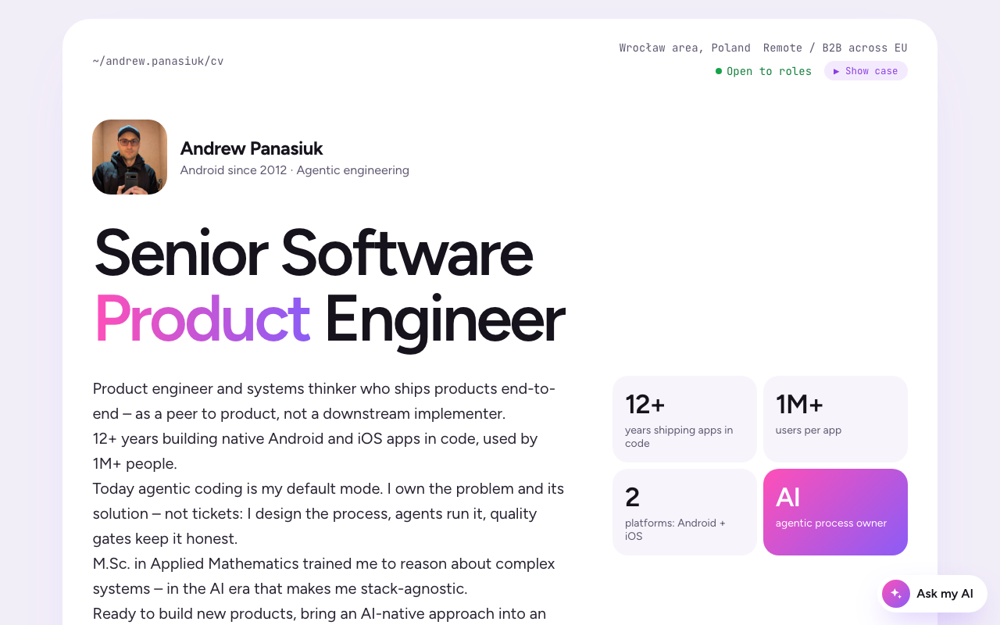
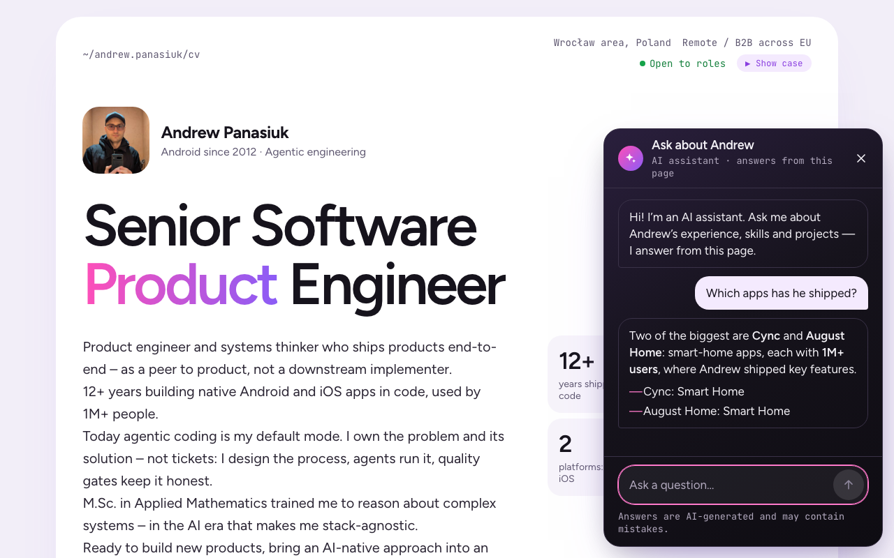

# CV Andrew Panasiuk

Andrew Panasiuk's CV as a website: **https://grandtorino.dev/**

Andrew is a Senior Software Product Engineer: Android since 2012, now building with AI agents. The
site is his CV, and it can talk back.

## What you can do on the site

- **Read the CV.** One page: summary and key numbers, how he works with agents, selected impact,
  jobs and projects, skills, education, and every way to reach him (email, WhatsApp, LinkedIn).
- **Ask the AI chat.** The floating chat answers questions about Andrew's experience, skills and
  projects, using only what is on the page. Suggested questions get you started.
- **Let the chat drive the page.** Ask it to show a section, highlight a job, an app or a skill
  group, or open a contact channel. It scrolls and highlights for you; opening a contact asks you
  to confirm first.
- **Watch the Show case.** The **Show case** button in the top bar turns the CV into a broken
  2000s web page, then an AI agent fixes it live, step by step, in a DevTools panel, until it is
  today's CV. You can chat with the agent while it works.

## How it's built

A static single-page app (Vite, React, TypeScript) on Vercel, with a small serverless endpoint for
the chat. The whole project is built by parallel Claude Code sessions coordinated through Linear:
an orchestrator files tasks, developer sessions build and review them, and CI deploys after green
checks.

- Contributors and coding agents: start with [`AGENTS.md`](AGENTS.md) and `.claude/skills/`.
- AI chat design: [`docs/chat/`](docs/chat/); the Show case: [`docs/retro/`](docs/retro/);
  decisions: [`docs/adr/`](docs/adr/).
- New repository from this process template: [`docs/SETUP.md`](docs/SETUP.md).
